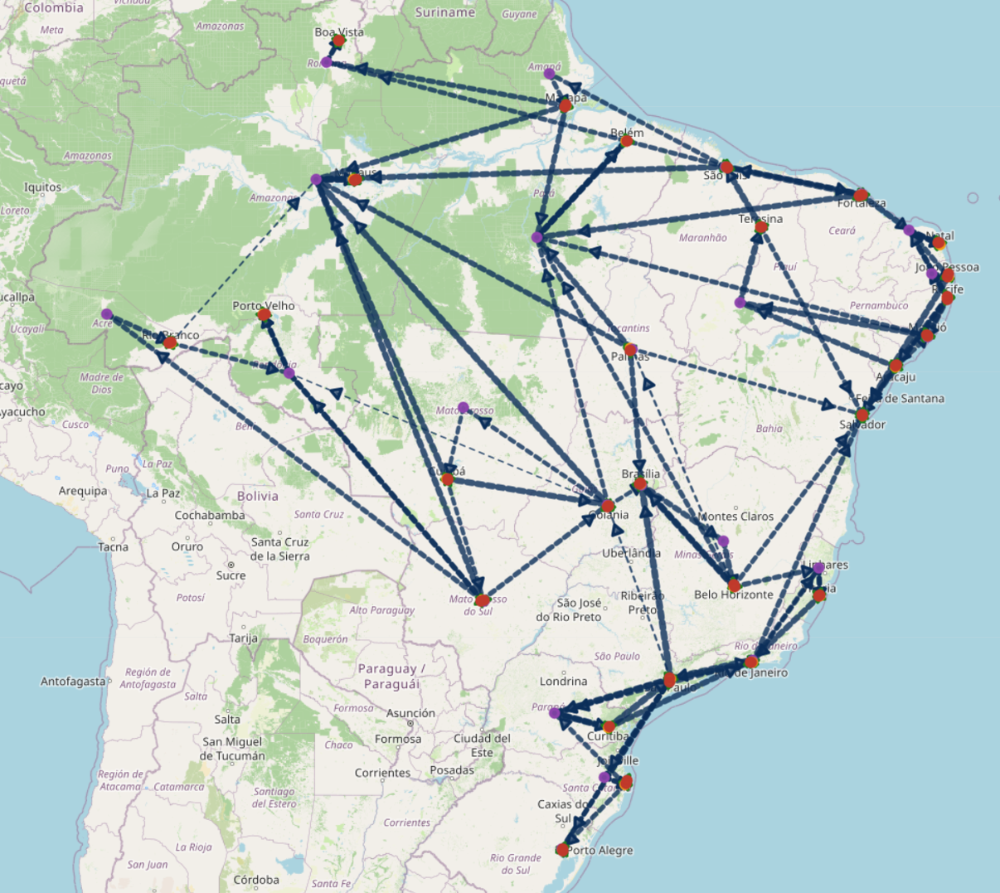

# 🚚 Otimização da Redistribuição de Vacinas no Brasil

Sistema de modelagem e resolução computacional baseado em **Programação Linear Inteira (PLI)** e **Pesquisa Operacional** para otimização logística e redistribuição estratégica de doses de vacinas, minimizando custos e tempos de transporte sob restrições logísticas e de perecibilidade.

> **Trabalho de Conclusão de Curso (TCC)**  
> **Instituição:** Universidade Federal do Rio de Janeiro (UFRJ) — Bacharelado em Ciência da Computação  
> **Autor:** [Matheus Percine](https://www.linkedin.com/in/matheus-percine)  
> 📊 **Apresentação do Projeto:** [Slides no Canva](https://canva.link/x6el98s17bjokx2)

---

## 📌 Visão Geral do Problema

O projeto aborda os desafios de distribuição e remanejamento de vacinas entre municípios e postos de saúde, considerando:
- **Geração de cenários:** Simulação e balanceamento de oferta e demanda com base em dados populacionais.
- **Multimodalidade:** Cálculo de tempos e custos de transporte rodoviário e aéreo.
- **Topologia de rede:** Modelos com e sem intermediação estadual.
- **Penalidades & Restrições:** Incorporação de restrições de perecibilidade e penalidades por não atendimento.

---

## 🗺️ Visualização Geoespacial das Rotas

As rotas ótimas geradas pelo solver são mapeadas dinamicamente com visualização geoespacial interativa.



### 🌐 Mapas Interativos Online (Demonstração Web)
Acesse as visualizações completas e interativas geradas para cada cenário:

- 🔹 **Modelo 1 (Sem Penalidade):** [mapa-rotas-m1-false.netlify.app](https://mapa-rotas-m1-false.netlify.app/)
- 🔹 **Modelo 1 (Com Penalidade):** [mapa-rotas-m1-true.netlify.app](https://mapa-rotas-m1-true.netlify.app/)
- 🔹 **Modelo 2 (Sem Penalidade):** [mapa-rotas-m2-false.netlify.app](https://mapa-rotas-m2-false.netlify.app/)
- 🔹 **Modelo 2 (Com Penalidade):** [mapa-rotas-m2-true.netlify.app](https://mapa-rotas-m2-true.netlify.app/)

---

## 🛠️ Tecnologias Utilizadas

- **Linguagem:** Python 3.13.7
- **Solver de Otimização:** [Gurobi Optimizer](https://www.gurobi.com/) (`gurobipy`)
- **Manipulação de Dados:** Pandas
- **Visualização Cartográfica:** Folium
- **Modelagem Matemática:** Programação Linear Inteira (PLI)

---

## ⚙️ Como Executar o Projeto

### 1. Pré-requisitos
- Python instalado (versão 3.13.7)
- Licença válida do Gurobi configurada localmente ([Gurobi Academic License](https://www.gurobi.com/academia/academic-program/))

### 2. Instalação das dependências
Clone o repositório e instale as bibliotecas necessárias:
```bash
git clone https://github.com/MatheusPercine/Optimizing_Vaccine_Distribution.git
cd Optimizing_Vaccine_Distribution
pip install -r requirements.txt
```

### 3. Configuração do Cenário de Execução
Abra o arquivo de configuração `caso_nacional/execucao.csv`:
- **Modelo:** Selecione o modelo desejado (`1` ou `2`).
- **Penalidade:** Ative ou desative penalidades por não atendimento ajustando para `True` ou `False`.

### 4. Execução do Solver
Execute o pipeline principal:
```bash
python aplicacao_modelos.py
```

Os resultados detalhados (fluxos entre nós, custos agregados, tempo total e alocação de doses) serão gerados automaticamente como arquivos `.csv` e arquivos interativos `.html` de visualização cartográfica.

---

## 📄 Licença & Contato

Desenvolvido por **Matheus Percine*.  
Para dúvidas ou colaborações, entre em contato via e-mail: `matheuspercine@gmail.com`.